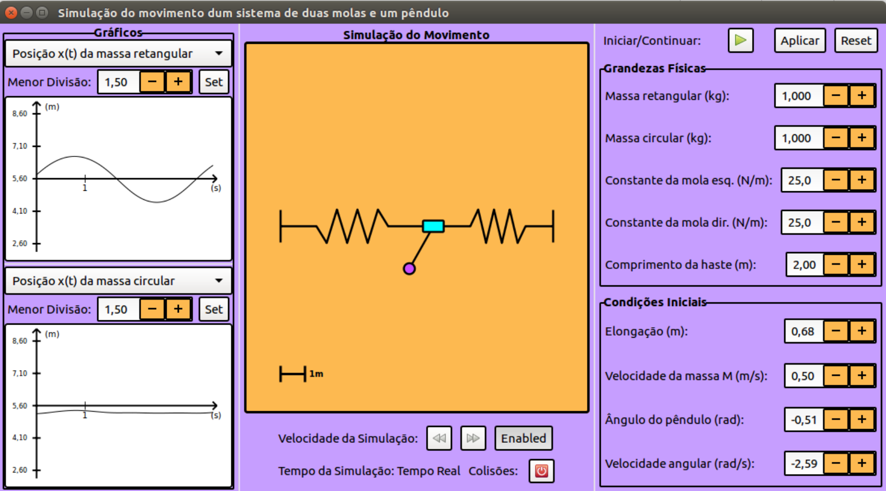

# Simulation of two strings attached to a pendulum

This was one of my first programming projects. It is a simulation of a physical system containing two springs attached to a mass, which is itself holding a pendulum. The project is written in C, and the GUI was built using the GTK3+ C library.

## Prerequisites

To build the project, you need to install a ***C compiler*** and the ***GTK3+ library***. There are plenty of tutorials regarding the installation of a C compiler. For the GTK3+ library, follow the instructions in [the GTK project](https://www.gtk.org/docs/installations/).

> [!IMPORTANT]
> The current stable GTK library is 4.0. However, <mark>GTK4 lacks backwards compatibility in major updates</mark>. To ensure that the project builds, I advise the installation of a GTK 3.x library.

## Run

To build the project, type `make` in a terminal.
To run, just type `./projecto` in the terminal and the GUI will open up!

## GUI

The project is only written in Portuguese. The manual_projecto.pdf is a manual about the program written in Portuguese. The GUI consists of 3 panels:
 - **Plots**: displays two real-time plots of the motion. You can choose from a variety of
                    coordinates to display.
 - **Simulation**: displays the motion of the masses and allows the user to control the speed of simulation and collision with wall.
 - **System parameters and Initial conditions**: allows the user to control the physical parameters of the masses and springs and set the initial conditions of the motion.

Here is a screenshot of the program.

## Issues

There are still some issues with the program. However, these are not critical for the correct function of the simulation. I still have to correct some CSS and a small memory leak.
